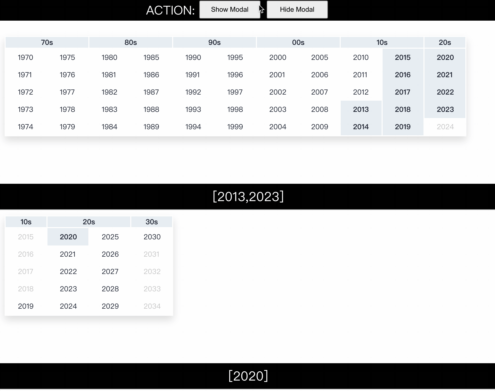
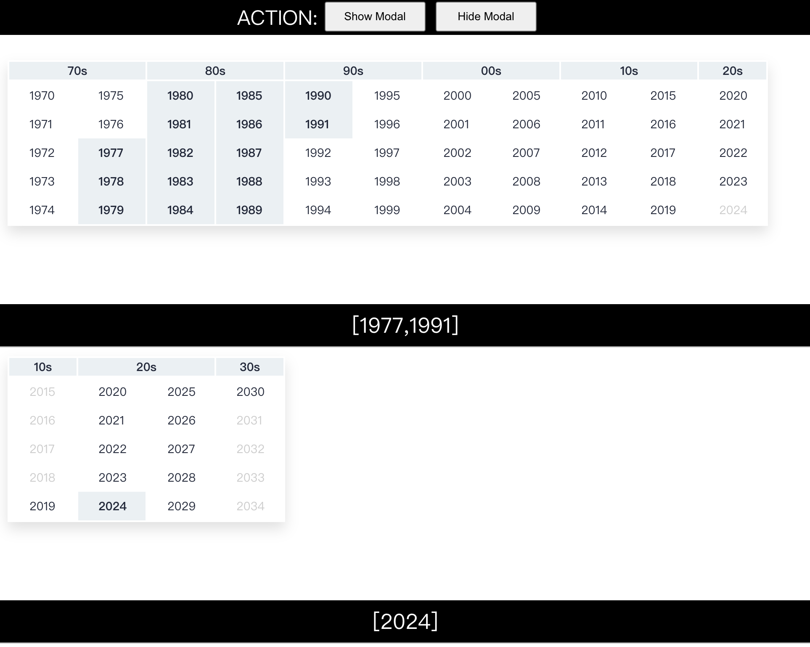

# JS Year Picker

A JavaScript Year Range Picker written by vanilla JS.



## Useage

If you want to use some configuration when the program is rendered, you can consider using the following code:

```js
let instance = YearPicker("#container", {
    preselected: 2020, range: [2019, 2030], updater: (selected) => {
        // your selected data here.
        console.log(selected);
    }
});

// options
instance.Show();
instance.Hide();
instance.GetSelected();
```

More details, see `dynamic-demo.html`.

## Preview



